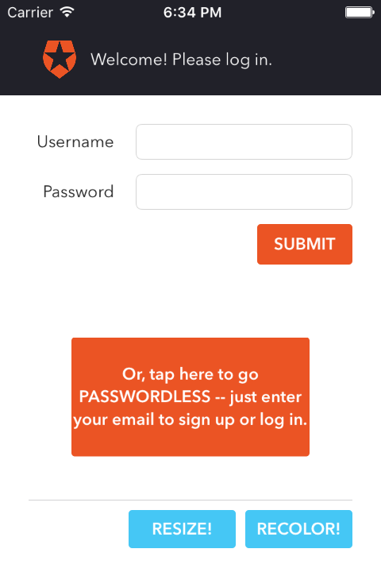

# Auth0Exercise
This app-exercise provides simple implementations of two Auth0 user authentication approaches:
- A simple username/password login (/oauth/ro)
- A login/signup path using Passwordless
The interface also allows the user to toggle between two different color schemes and two different font sizes.

Additionally, this repo contains a version of the same component as a React Native application, following [this model]((https://facebook.github.io/react-native/docs/native-components-ios.html#content).

## Usage
### "Regular" Native version
1. Install Xcode from the [app store](https://itunes.apple.com/us/app/xcode/id497799835?mt=12)
2. Clone or Download Auth0Exercise
3. Open Auth0Login/Auth0Login.xcodeproj
4. Click the Play button (Cmd-R) to build and run the app

### React Native version
1. Install Xcode from the [app store](https://itunes.apple.com/us/app/xcode/id497799835?mt=12)
2. Clone or Download Auth0Exercise
3. Open ReactNativeExampleApp/ios/ReactNativeExampleApp.xcodeproj
4. Click the Play button (Cmd-R) to build and run the app

